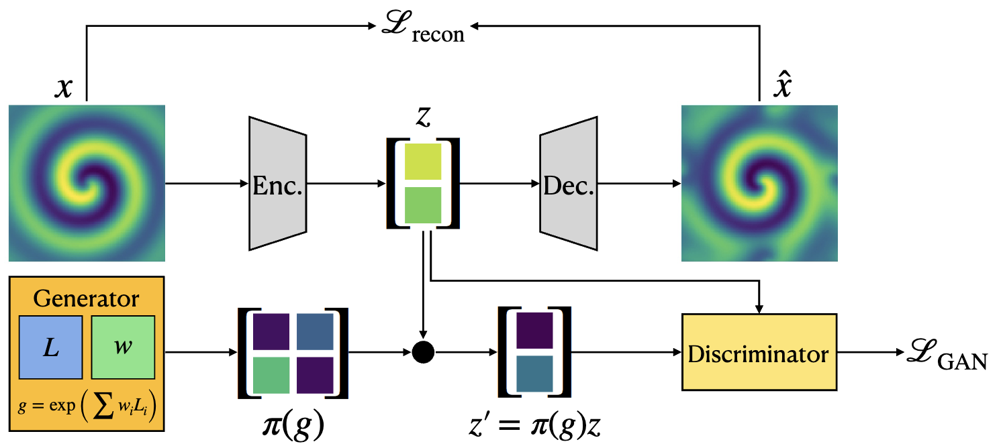

# Latent Space Symmetry Discovery (LaLiGAN)

Code for our ICML 2024 paper, [Latent Space Symmetry Discovery](https://arxiv.org/pdf/2310.00105).



## Setup the Environment

```
conda create -n laligan python=3.9
conda deactivate
conda activate laligan

pip3 install torch torchvision torchaudio --index-url https://download.pytorch.org/whl/cu118
pip3 install scipy==1.10.1
pip3 install tqdm==4.64.1

cd src
```

## Setup Datasets

### Reaction-Diffusion System
The system is simulated with the Matlab scripts provided in [SINDy Autoencoders](https://github.com/kpchamp/SindyAutoencoders/tree/master/rd_solver).

Running the script `reaction_diffusion.m` should produce the data file `reaction_diffusion.mat`. Then, place it under `./data` in this repository.

Alternatively, download the data from [this link](https://drive.google.com/file/d/1N-oV4wGCBo6TxUX8VuUhWiAlVvuUokaj/view?usp=sharing).

### Rotating Object
Generate the renderings of a bookshelf with different orientations:
```
python data_utils/rot_obj.py --num_samples 10000 --name train
python data_utils/rot_obj.py --num_samples 100 --name val
python data_utils/rot_obj.py --num_samples 100 --name test
```

## Experiments

### Reaction-Diffusion System
LaLiGAN Symmetry discovery in 2D latent space:
```
python main.py --config rd
```
LaLiGAN Symmetry discovery in 3D latent space:
```
python main.py --config rd_3d
```
SINDy equation discovery in the LaLiGAN 2D latent space:
```
python main_sindy.py --config rd_sindy
```
SINDy equation discovery in the LaLiGAN 3D latent space:
```
python main_sindy.py --config rd_sindy_3d
```
SINDy Autoencoder equation discovery in the 3D latent space:
```
python main.py --config rd_sindyonly
```

### Nonlinear Pendulum
LaLiGAN Symmetry discovery for nonlinear pendulum:
```
python main.py --config pendulum
```
(Baseline) LieGAN symmetry discovery for nonlinear pendulum:
```
python main.py --config pendulum_liegan
```
SINDy equation discovery in the LaLiGAN latent space:
```
python main_sindy.py --config pendulum_sindy
```
SINDy Autoencoder equation discovery:
```
python main.py --config pendulum_sindyae
```
SINDy equation discovery w/o autoencoder:
```
python main.py --config pendulum_sindyonly
```

### Lotka-Volterra Equations
LaLiGAN Symmetry discovery for Lotka-Volterra system:
```
python main.py --config lv
```
(Baseline) LieGAN symmetry discovery Lotka-Volterra system:
```
python main.py --config lv_liegan
```
SINDy equation discovery in the LaLiGAN latent space:
```
python main_sindy.py --config lv_sindy
```
SINDy Autoencoder equation discovery:
```
python main.py --config lv_sindyae
```
SINDy equation discovery w/o autoencoder:
```
python main.py --config lv_sindyonly
```

### Double Bump World
Learning $\mathrm{SO}(2) \times \mathrm{SO}(2)$ equivariant representation:
```
python main.py --config double_bump
```

### Rotating Object
Learning $\mathrm{SO}(3)$ equivariant representation:
```
python main.py --config rs
```

## Cite
```
@article{yang2024latent,
  title={Latent Space Symmetry Discovery},
  author={Yang, Jianke and Dehmamy, Nima and Walters, Robin and Yu, Rose},
  booktitle={International Conference on Machine Learning, {ICML} 2024},
  series={Proceedings of Machine Learning Research},
  year={2024}
}
```
